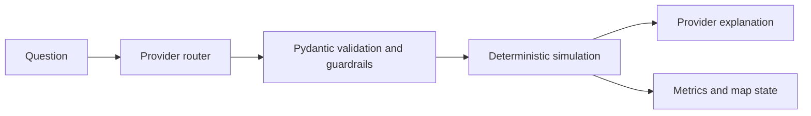

# Airline Network Robustness

[](https://github.com/DCSlucifer/airline-robustness-starter/actions/workflows/ci.yml)
[](https://www.python.org/)
[](LICENSE)

A graph-theoretic toolkit for simulating disruptions to airline networks, measuring
topological damage, and comparing defensive route additions. It includes a reproducible CLI,
an interactive Streamlit dashboard, and optional bring-your-own-key AI workflows.

## Capabilities

- Build a validated directed airport-route graph from OpenFlights-format CSV files.
- Simulate targeted, random, edge-betweenness, geographic, and community-bridge attacks.
- Evaluate greedy route addition and critical-node hardening strategies.
- Track GWCC, GSCC, path-length, diameter, and bounded-hop reachability metrics.
- Explore attacks, replay steps, cluster the map, and commit scenarios in Streamlit.
- Route natural-language what-if questions through OpenAI or Anthropic to the real simulator.
- Build a local citation-aware RAG index and evaluate retrieval recall.

## Status

| Area | Status |
|---|---|
| Core algorithms, CLI, dashboard, packaging | Verified locally |
| Offline AI/RAG behavior | Covered by stubbed tests; no key required |
| Live OpenAI/Anthropic calls and RAG evaluation | Ready for BYOK; not run without user keys |
| Generated RAG corpus and index | Local-only; not committed |

## Installation

Python 3.10 or newer is required.

```bash
git clone https://github.com/DCSlucifer/airline-robustness-starter.git
cd airline-robustness-starter

python -m venv .venv
```

Activate the environment:

```powershell
# Windows PowerShell
.venv\Scripts\Activate.ps1
```

```bash
# macOS/Linux
source .venv/bin/activate
```

Install runtime dependencies:

```bash
python -m pip install -r requirements.txt
```

For development and verification, install the editable package and quality tools:

```bash
python -m pip install -r requirements-dev.txt
```

The package exposes the `airline-robustness` console command. Repository data and the default
configuration are intentionally not bundled into the wheel, so run the default scenario from
the repository root or supply your own `--config` path.

## Quick start

Launch the local dashboard:

```bash
python -m streamlit run src/app/streamlit_app.py
```

Then open `http://localhost:8501`, load the default CSV files, configure an attack or defense,
and inspect the replay map and metric changes. Large graphs automatically start in fast metric
mode; clear that option when exact path metrics are required and longer runtimes are acceptable.

Run a deterministic CLI scenario:

```bash
python -m src.simulate \
  --attack targeted_nodes \
  --metric degree \
  --k 10 \
  --adaptive \
  --fast \
  --seed 42
```

On PowerShell, place the command on one line or use PowerShell's backtick for continuation.

## CLI

```text
python -m src.simulate [--config PATH] [--mode attack|defense]
  [--attack targeted_nodes|random_nodes|edge_betweenness|geographic_radius|community_bridge]
  [--metric degree|betweenness|pagerank|CI]
  [--adaptive|--no-adaptive] [--fast|--no-fast]
  [--k N] [--m N] [--R N] [--seed N]
  [--budget N] [--distance-km-max KM]
  [--lat LAT --lon LON --radius-km KM]
  [--output-dir PATH]
```

Examples:

```bash
# Random failures with a reproducible seed
python -m src.simulate --attack random_nodes --k 50 --R 20 --seed 42 --fast

# Geographic disruption around JFK
python -m src.simulate --attack geographic_radius --lat 40.64 --lon -73.78 --radius-km 500 --fast

# Greedy defensive route additions
python -m src.simulate --mode defense --budget 5 --distance-km-max 3000 --fast

# Installed console entry point with an explicit config
airline-robustness --config config/default.yaml --attack community_bridge --m 15 --fast
```

The CLI writes standards-compliant JSON atomically. Depending on the scenario, outputs include
`baseline_report.json`, `attack_log.json`, a scenario-specific attack log such as
`attack_log_targeted_nodes_degree.json`, or `defense_log.json`.

Generate plots from real attack artifacts:

```bash
python plot_results.py --input-dir outputs --output-dir outputs/plots
```

Use `python plot_results.py --demo` only when explicitly generating labeled demonstration data.

## Attack and defense models

| Model | Purpose |
|---|---|
| Targeted node removal | Removes airports ranked by degree, betweenness, PageRank, or Collective Influence |
| Random node failures | Runs repeated seeded airport-outage simulations |
| Edge-betweenness attack | Removes routes that act as high-betweenness bridges |
| Geographic radius attack | Removes airports within a great-circle radius |
| Community-bridge attack | Removes routes connecting detected communities |
| Greedy edge addition | Adds geographically constrained routes to improve connectivity |
| Node hardening | Ranks critical airports for protection planning |

Adaptive attacks recompute scores after each removal. Deterministic tie-breaking and local random
number generators make repeated runs with the same inputs and seed reproducible.

## Metrics

| Metric | Meaning |
|---|---|
| GWCC | Fraction of nodes in the giant weakly connected component |
| GSCC | Fraction of nodes in the giant strongly connected component |
| ASPL | Average shortest-path length within the undirected GWCC |
| Diameter | Maximum shortest-path length within the undirected GWCC |
| OD within H hops | Structural origin-destination reachability within a bounded number of hops |

Fast mode skips expensive ASPL, diameter, and bounded-hop calculations. It is intended for
responsive exploration, while `--no-fast` computes the full report.

## AI what-if assistant

The dashboard can turn a natural-language scenario into a validated simulator tool call:



Simulation metrics are computed by the project engine. The natural-language explanation is
model-generated and should still be reviewed. The AI layer provides:

- OpenAI and Anthropic clients behind a shared interface.
- Structured tool selection, tool allow-listing, and bounded arguments.
- Response validation for empty, refused, or malformed provider output.
- A labeled router evaluation set and provider-aware evaluation command.
- Optional JSONL tracing utilities; tracing is not enabled by default.

Evaluate a live provider after adding a key:

```powershell
$env:OPENAI_API_KEY = "sk-..."
python -m src.ai.eval.runner --provider openai

$env:ANTHROPIC_API_KEY = "..."
python -m src.ai.eval.runner --provider anthropic
```

On macOS/Linux, use `export OPENAI_API_KEY=...` or `export ANTHROPIC_API_KEY=...`.

### Key handling

The dashboard uses bring-your-own-key fields. Keys are password-masked, held in Streamlit server
session state, sent only to the selected provider, and are not written to project files or app
logs. Provider data policies still apply. The what-if assistant and Resilience Advisor use
separate key fields; the Advisor currently requires OpenAI for both embeddings and answers.

Never commit `.env` or `.streamlit/secrets.toml`; both are ignored by Git.

## Resilience Advisor (RAG)

The optional Advisor retrieves local knowledge-base chunks, asks OpenAI for a citation-bearing
answer, and validates that citation markers match the returned source list. The persisted index
records its embedding model, vector dimensions, corpus hash, and schema metadata.

Build the local artifacts in this order:

```bash
# Requires network access to fetch the configured Wikipedia articles.
python -m src.ai.rag.corpus

# Requires OPENAI_API_KEY for embeddings.
python -m src.ai.rag.index

# Requires OPENAI_API_KEY and the compatible index above.
python -m src.ai.rag.eval_rag
```

The corpus records the source revision returned at fetch time. `data/kb/` is generated locally
and ignored by Git; the repository does not ship a prebuilt index. The dashboard disables the
Advisor with a setup message until a valid, model-compatible `data/kb/index.npz` exists.

Live router and retrieval scores are intentionally not claimed here because provider evaluations
have not been run without user-supplied keys. All offline AI and RAG tests use fakes and require
neither keys nor network access.

## Configuration

The default scenario is defined in `config/default.yaml`:

```yaml
random_seed: 42
hops_H: 4
repetitions_R: 10
adaptive: true
distance_km_max: 3000
budget_b: 5
k_nodes: 10
m_edges: 20
collective_influence_l: 2

airports_csv: data/airports.csv
routes_csv: data/routes.csv
output_dir: outputs
```

CLI flags override corresponding configuration values. Invalid counts, coordinates, radii,
paths, or configuration types fail with actionable errors instead of producing partial output.

## Data

The included CSV files follow the OpenFlights airport and route formats:

- `airports.csv` requires `iata`, `lat`, and `lon`; `name` and other metadata are preserved.
- `routes.csv` requires `source_iata` and `dest_iata`.
- Missing IATA markers, invalid coordinates, self-loops, and dangling routes are rejected or
  filtered during validation and graph construction.

The software accepts custom files through the dashboard or `config/default.yaml`.

The OpenFlights databases are licensed under ODbL, with individual database contents under
DbCL. The route snapshot is historical and must not be used for navigation or current operational
decisions. See [DATA_LICENSE.md](DATA_LICENSE.md) for attribution and redistribution obligations.

## Development and verification

Run the same quality gates used by CI:

```bash
python -m ruff check .
python -m ruff format --check .
python -m pytest tests -q --cov=src --cov-report=term-missing
python scripts/verify_package.py
```

CI verifies Python 3.10 through 3.13, enforces at least 85% statement coverage, and smoke-tests
the built wheel from outside the checkout. Live provider calls are deliberately excluded from CI.

Validate the bundled dataset separately:

```bash
python check_load.py
```

## Project layout

```text
config/                  Default simulation configuration
data/                    OpenFlights-format airport and route data
scripts/                 Packaging verification utilities
src/
  ai/                    Provider clients, orchestration, evals, and RAG
  app/                   Streamlit UI and scenario-state helpers
  attacks.py             Attack algorithms
  defenses.py            Defense algorithms
  metrics.py             Topological metrics
  simulate.py            CLI entry point
tests/                   Offline unit, integration, CLI, and UI tests
DATA_LICENSE.md          Dataset licensing and attribution
LICENSE                  MIT software license
pyproject.toml           Package and quality-tool configuration
requirements*.txt        Runtime and development environments
```

## Known limitations

- The graph is topology-focused; route distance is available, but traffic, capacity, and demand
  are not modeled.
- The bundled route snapshot is historical and does not represent current schedules.
- Schedule timing, missed connections, airline alliances, and code sharing are out of scope.
- Greedy defense is a deterministic heuristic, not a globally optimal network design solver.
- Exact path metrics and adaptive centrality attacks can be expensive on the full graph.
- AI explanations depend on third-party provider availability and should not be treated as
  operational aviation advice.

## References

- Albert, R., Jeong, H., & Barabasi, A.-L. (2000). Error and attack tolerance of complex
  networks. *Nature*, 406, 378-382.
- Lordan, O., Sallan, J. M., Simo, P., & Gonzalez-Prieto, D. (2014). Robustness of the air
  transport network. *Transportation Research Part E*, 68, 155-163.
- [OpenFlights data documentation](https://openflights.org/data)

## License

Project code is released under the [MIT License](LICENSE). The bundled OpenFlights-derived data
has separate terms documented in [DATA_LICENSE.md](DATA_LICENSE.md).
